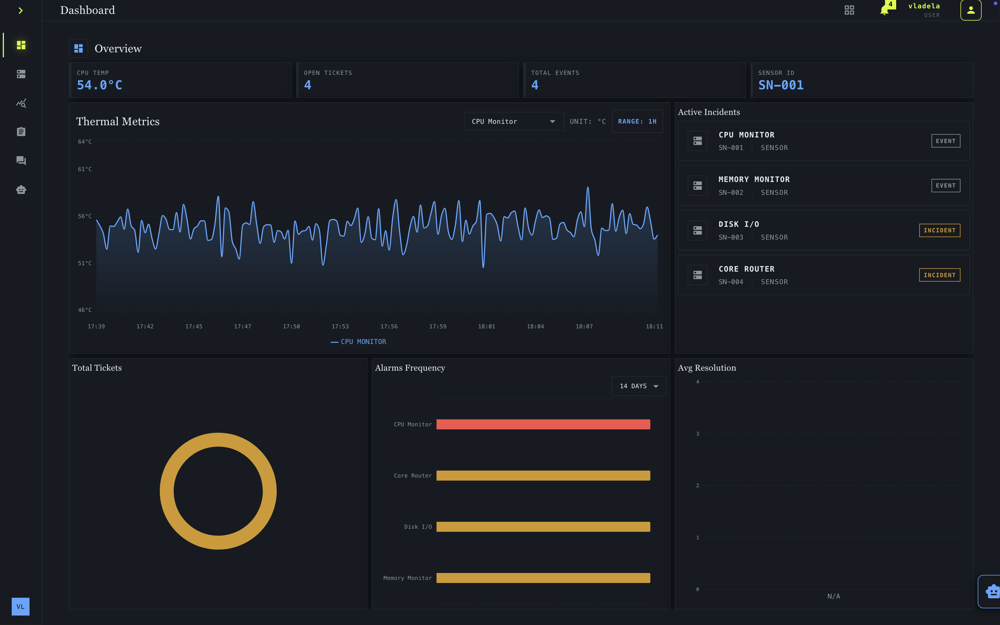
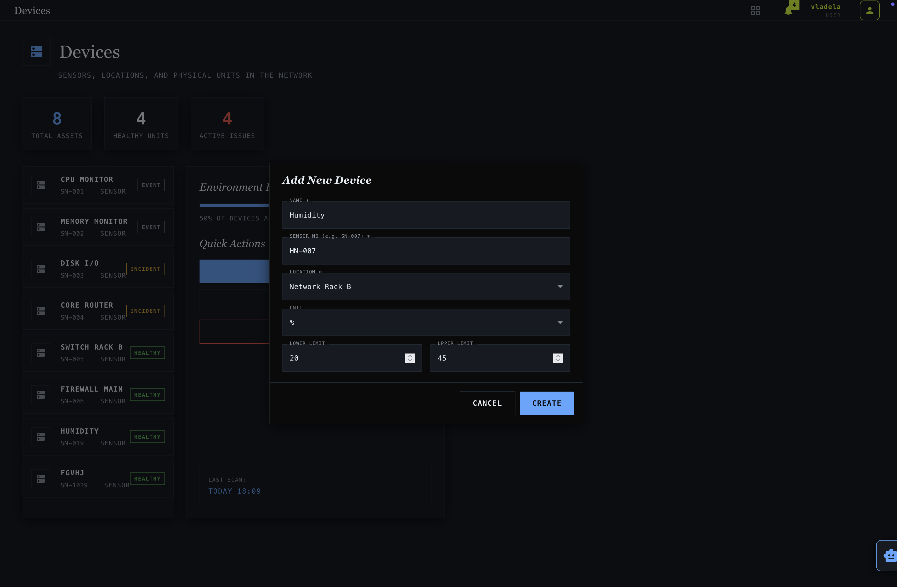
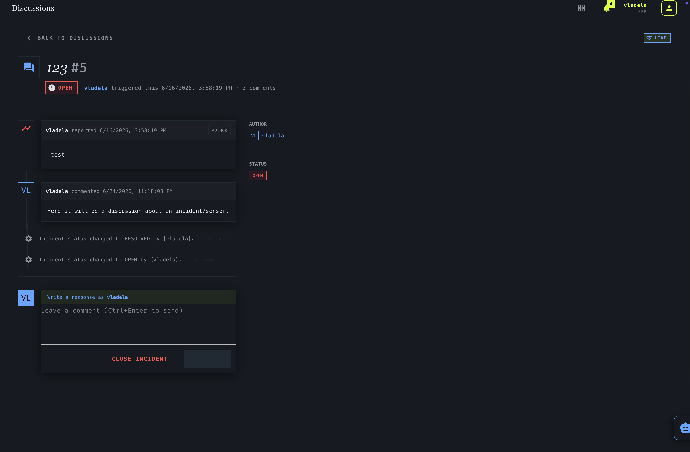
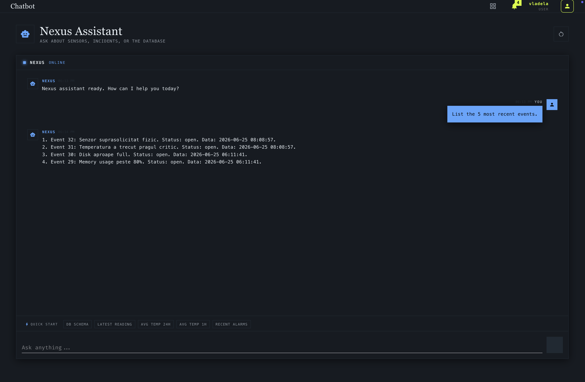

# Nexus 

Nexus is a platform that has a role to observe the analystics of sensors and monitor them. The main role is to make monitoring easier and alert the devs when needed.

---

## How it works

_For the purpose of demo, the sensors are not real and the data is just synthetic, generated by an algorithm we found online for getting as close as possible real sensor readings._

-  You add a device and set its limits
-  Monitor on the dashboard a selected sensor
-  Create a discussion when there is an incident/alarm and participate to discussion with other engineers
-  Ask Chatbot AI something from the database for an easier filter
-  Get an alarm notification on email when it's triggered

---
## Preview

### Dashboard

  

### Add device

  

### Discussion page

  

### Chatbot assistant

  

## Tech Stack

### Frontend 

- **React + MUI**
- **Vite**
- **Recharts**

### Backend
- **Go**
- **Python**
- **TimescaleDB**

## University Project

Built during the 2nd year of uni for Nokia.

---

  Made with ❤️ for Nokia w/ Nexus team.

